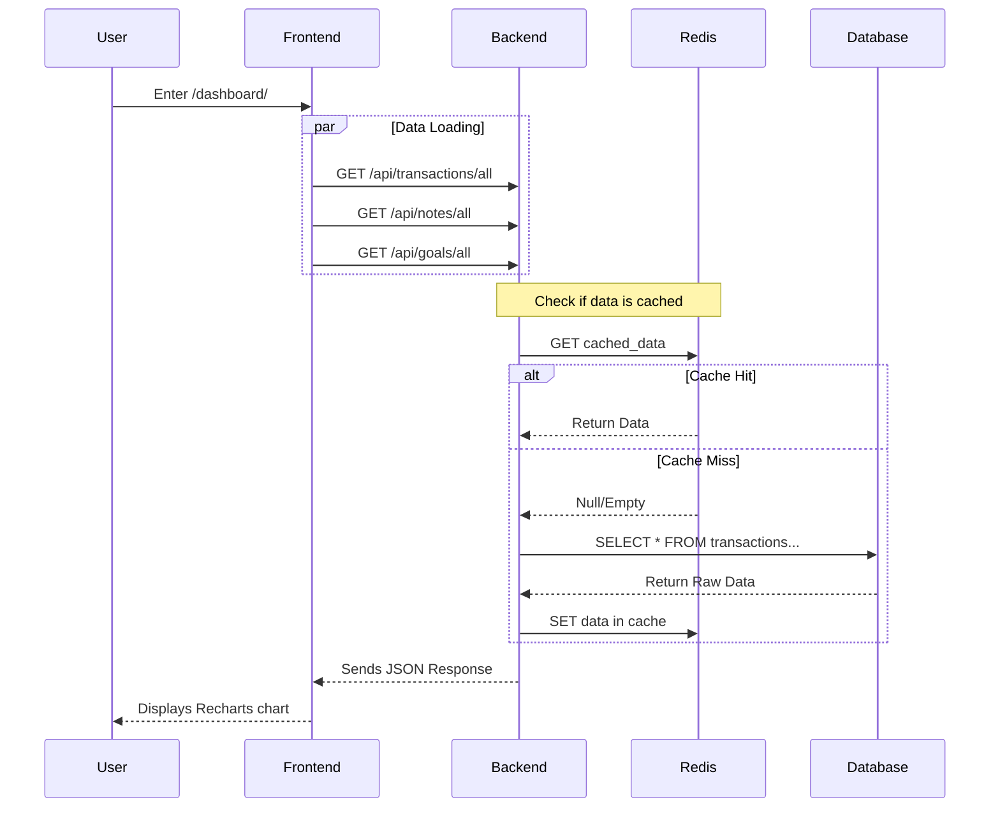

# Budget tracker - Multi-Service App
[](https://roadmap.sh/projects/multiservice-docker)
[](https://opensource.org/licenses/MIT)

A expanded personal finance management application that helps you track expenses, monitor budgets and visualize data, so it help you manage your finance habits. 

## Architecture & Tech Stack

This project is designed to demonstrate modern DevOps practices, including container orchestration and secret management.

* **Frontend:** React / Next.js with **Recharts** for data visualization.
* **Backend:** Node.js (Express.JS) with REST API.
* **Database:** MongoDB & Redis for caching.
* **Orchestration:** Docker Swarm & Kubernetes (K8s).
* **Security:** JWT Authentication & Sealed Secrets.



## Key Features

* **Financial Tracking:** Log revenues/expenses with categorized breakdowns.
* **Goal Management:** Set, monitor, and achieve financial milestones.
* **Smart Notes:** Markdown-supported notes for every transaction or goal.
* **Advanced Analytics:** Interactive charts with custom date filtering.
* **Security First:** Secure authentication with JWT and robust secret management via Docker Secrets/Sealed Secrets.

## Installation

### Docker Swarm

#### Prerequisites
- Docker
- Docker Swarm

#### Config
```sh
# Clone the repository
git clone https://github.com/LisZLisowni2/budget-tracker 

# Init docker swarm
docker swarm init

# Create Secrets for sensitive data
echo "<input your db_password>" | docker secret create db_password -
echo "<input your redis_password>" | docker secret create redis_password -
echo "<input your jwt_token>" | docker secret create jwt_token -

# Create private registry 
docker service create --name registry --publish mode=host,target=5000,published=5000,protocol=tcp registry:2
```

#### Build 
```sh
# Build frontend 
docker build -t 127.0.0.1:5000/budget-tracker-frontend:latest -f ./frontend/Dockerfile ./frontend

# Build backend
docker build -t 127.0.0.1:5000/budget-tracker-backend:latest ./backend

# Push images
docker push 127.0.0.1:5000/budget-tracker-frontend:latest
docker push 127.0.0.1:5000/budget-tracker-backend:latest 
```

#### Run
```sh
docker stack deploy -c docker-compose.yml BudgetTrackerStack
```

### K8s Cluster

The project contains K8s manifests. Remember to replace JWT-TOKEN Sealed Secret with own using kubeseal.

## References
- API Docs: 
    - `127.0.0.1:3000/api-docs` (after running application)
    - Endpoints API document
- License: MIT License
- Chart library by Recharts
